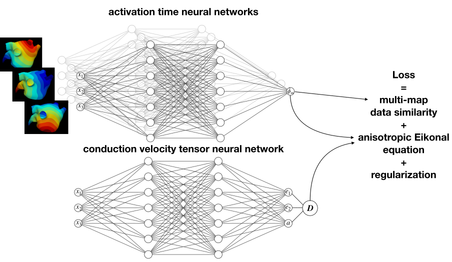

# Physics-informed neural networks to learn cardiac fiber orientation from multiple electroanatomical maps

Carlos Ruiz Herrera\*, Thomas Grandits\*, Gernot Plank, Paris Perdikaris, Francisco Sahli Costabal, Simone Pezzuto

Project homepage: https://fsahli.github.io/research/fibernet.html  
arXiv: https://arxiv.org/abs/2201.12362


2D example [](https://colab.research.google.com/drive/1h5A9LNhvLoIUouFKkL3DZYvM2u3QLXo-?usp=sharing)
3D example [](https://colab.research.google.com/drive/1hBQG12tfEa2wRATjpmgUCREDtzc5RHaZ?usp=sharing)



This repository contains a demo implementation of our paper [`Physics-informed neural networks to learn cardiac fiber orientation from multiple electroanatomical maps`](#citation). 
It contains a few 2D and 3D examples showcasing how FiberNet works and can optimize fiber orientations from multiple electroanatomical maps.
For more technical information on the approach, please have a look at the [project page](https://fsahli.github.io/research/fibernet.html) or the [arxiv paper](https://arxiv.org/abs/2201.12362).

# Installation

All examples are provided in the form of [jupyter-notebooks](https://jupyter.org).
To run, makes sure you have python3 installed and then run 
```bash
pip install -r requirements.txt
```
from your command line.
The notebooks can then be easily accessed by starting the jupyter-server via the command
```bash
jupyter-notebook
```

# Provided Examples

- [2D_example](2D_example.ipynb)

	Reconstructs the fiber orientation and velocity of two piecewise constant regions on a square

- [2D_example_aniso](2D_example_aniso.ipynb)

	Same as above, but considers different levels of anisotropy between the two regions

- [3D_example](3D_example.ipynb)

	Reconstructs the fiber orientation of a rule-based in-silico left atrial model for randomly paced pacing and measurement locations

- [3D_example_CS](3D_example_CS.ipynb)

	Same as above, but considers only the approximate Bachmann bundle and coronary sinus locations as pacing loactions

# Citation

```bibtex
@article{ruiz_herrera_physics_informed_2022,
	title = {Physics-informed neural networks to learn cardiac fiber orientation from multiple electroanatomical maps},
	issn = {1435-5663},
	url = {https://doi.org/10.1007/s00366-022-01709-3},
	doi = {10.1007/s00366-022-01709-3},
	language = {en},
	urldate = {2022-07-22},
	journal = {Engineering with Computers},
	author = {Ruiz Herrera, Carlos and Grandits, Thomas and Plank, Gernot and Perdikaris, Paris and Sahli Costabal, Francisco and Pezzuto, Simone},
	month = jul,
	year = {2022},
	keywords = {Anisotropic conduction velocity, Cardiac electrophysiology, Cardiac fibers, Deep learning, Eikonal equation, Physics-informed neural networks},
}
```
